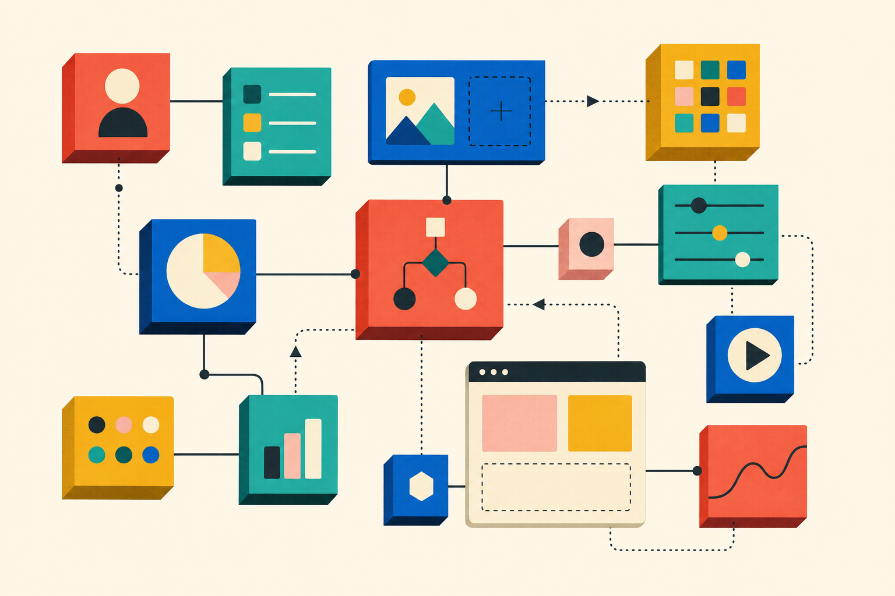

# סוף שבוע אחד, מערכת CRM שלמה: איך ה-AI מאיים על מעצמת ה-no-code הישראלית

בסוף שבוע אחד בתחילת 2026, מנהל לשעבר באמזון פתח את המחשב הנייד שלו, הריץ את Claude Code של Anthropic, וביום שני בבוקר הייתה לו מערכת CRM פעילה. לא MVP. לא אב-טיפוס. מערכת עובדת — מהסוג שעד לא מזמן דרשה צוות יישום, חוזה רב-שנתי וחשבונית של מאות אלפי דולרים מספק תוכנה ארגוני. הסיפור הזה, שדווח ב-Ynet, הפך תוך שבועות לאנקדוטה שמסבירה למה מניית monday.com — סמל הצלחת ה-SaaS הישראלית — איבדה 21% בפברואר 2026.

זה לא רק שוק שמתקרר. זו שאלה האם המודל העסקי שעליו נבנה אחד הסיפורים הכלכליים הגדולים של ישראל בעשור האחרון — עוד תקף.

## איך ישראל הפכה למעצמת no-code

כדי להבין את גודל הסיכון, צריך להבין את גודל ההצלחה. monday.com, שהוקמה ב-2012 על ידי רועי מן וערן זינמן (שניהם בוגרי יחידה 9900), השיקה את שמה ב-2016 כשהכנסותיה עמדו על 20 מיליון דולר. בקיץ 2024 היא חצתה את רף המיליארד דולר ב-ARR. שווי השוק שלה הגיע לכ-13.8 מיליארד דולר, היא בין חמש החברות הישראליות הגדולות לפי שווי שוק, ושיעור הרווח הגולמי שלה — 90%. כך לפי CTech.

מן וזינמן לא הסתפקו בזה. "אנחנו רואים את החברה בגיל ההתבגרות... אנחנו מאמינים שאנחנו יכולים לגדול פי עשרה," אמרו ל-CTech בנובמבר 2024. היעד שהציבו: 10 מיליארד דולר הכנסה. תוך שנה אחת בלבד מהשקת מוצר ה-CRM שלה, monday.com הגיעה למקום הרביעי בקטגוריית CRM לעסקים בינוניים.

monday.com היא לא לבד. סביבה צמחה אקוסיסטמה שלמה של no-code ישראלי — Wix בעיצוב אתרים, Make (לשעבר Integromat) באוטומציה, UiPath ו-Workato בתחום ה-RPA. כולן רכבו על אותה הבטחה: לקחת משימות שבעבר דרשו מתכנתים, ולפתוח אותן לכל מי שיודע לגרור ולשחרר.

## השוק המקומי: 92% מהעסקים, וכמה שמות שאתם לא מכירים

מתחת לכותרות הגלובליות, השוק הישראלי המקומי בנה לעצמו תשתית שונה לחלוטין. לפי המדריך של אביאור אהרוני מאוגוסט 2025, 92% מהחברות בישראל כבר משתמשות במאגרי מידע לקוחות בצורה כזו או אחרת, וההטמעה של מערכת CRM מתקדמת מתורגמת לעלייה של 20-50% במכירות.

מי שמשרת את העסקים האלה הם לרוב **לא** השמות הבינלאומיים. זה אוריגמי CRM — פלטפורמת no-code לבניית מערכות מותאמות. זה ZebraCRM של אייקום תוכנה. זה Priority שמחבר ERP ו-CRM באותו רובד, ו-MyBusiness CRM שמשלב גם רכיב פיננסי. השם המוביל בלידים, HelloLeads, מדווח גם הוא על אותו טווח של 20-50% בשיפור המכירות.

הסיבה שהשמות המקומיים שולטים פשוטה: עברית, רגולציה, ושירות. תיקון מספר 13 לחוק הגנת הפרטיות, שנכנס לתוקף ב-2025, "הביא איתו שינויים משמעותיים הדומים ל-GDPR האירופית", כדברי אהרוני. ספק זר שלא יודע להתמודד עם תקן האבטחה הישראלי, או שלא מציע ממשק עברית מלא, פשוט לא רלוונטי לרוב העסקים הקטנים והבינוניים בארץ.

זה היה אמור להיות שוק יציב. עסקים מצטרפים, ספקים מתחזקים, פלטפורמות no-code ישראליות וגלובליות חוגגות. ואז הגיע 2025.

## הטלטלה: כשה-AI הופך את ה-CRM למצרך

המספרים מ-Ynet קשים לעיכול. מדד ה-SaaS ירד ב-6.5% בשנת 2025, בעוד ש-S&P 500 עלה ב-17.6%. מכפיל ההכנסות החציוני של חברות SaaS נפל מ-7 ויותר אל מתחת ל-5. NICE הייתה המניה היחידה במדד תל אביב 35 עם תשואה שלילית ב-2025. monday.com, Wix ו-NICE — כולן איבדו "עשרות אחוזים" משוויין במהלך השנה והמשיכו להידרדר ב-2026.

מאחורי המספרים יש סיפור אחד: agentic AI. כלים כמו Claude Code של Anthropic מאפשרים למישהו ללא רקע בפיתוח לבנות מערכת ייעודית — CRM, ניהול משימות, אוטומציות מורכבות — תוך ימים, לא חודשים. הסיפור של מנהל האמזון לשעבר הוא הדגמה, לא יוצא דופן.

הקולות מקהילת ההשקעות חדים. דין שחר מ-DTCP אמר: "מייסד שיגיע לקרנות הון סיכון עם סטארטאפ SaaS לא יגיע אפילו לשלב ה-pitch. ה-AI הפך את התוכנה למצרך, ויתרון תחרותי הוא כמעט בלתי אפשרי." ליאור הנדלסמן מ-Grove Ventures הוסיף: "SaaS מתמודדת עם אתגרים בשמירה על קצב הצמיחה. המחסומים נופלים, וההגעה לשוק עם מוצר ראשון להוכחת היתכנות — קלה."

מנגד, ההנהלות לא נכנעות. רועי מן וערן זינמן ממשיכים לטעון שהיעד של 10 מיליארד דולר ריאלי. עמדתם, כפי שצוטטה ב-CTech: "עבורנו, AI הוא לא איום אלא דחיפה. monday בשילוב עם AI הוא צירוף עוצמתי." השאלה היא אם משקיעים מוכנים לקבל את הקו הזה כשמכפיל ההכנסות צונח ומניות הסקטור מאבדות גובה.

## לאן מכאן

יש כאן שני סיפורים שמתנהלים במקביל. הסיפור האחד הוא של חברות הענק — monday.com, Wix, NICE — שצריכות להוכיח שיש להן יותר מאשר ממשק נחמד מעל מסד נתונים. שהן יודעות להפוך את עצמן לתשתית שעליה ה-AI רץ, ולא לתחליף שה-AI מייתר. הסיפור השני, השקט יותר, הוא של השוק המקומי: עסק קטן בפתח תקווה, רואה חשבון בחיפה, חברת לוגיסטיקה באשדוד — אלה ימשיכו להזדקק למערכת בעברית, עם תמיכה מקומית, שעומדת בתיקון 13. השאלה היא אם ספקי ה-CRM הישראליים הקלאסיים ימשיכו לבנות עבורם — או שייצאני ה-AI יבנו לעצמם.

עשור ה-no-code הישראלי הוכיח שהפיכת התוכנה לידידותית היא עסק של מיליארדים. השאלה של 2026 היא אם עידן ה-agentic AI יעשה את אותו דבר לתוכנה עצמה — וייקח את הענפים שעליהם נבנתה ההצלחה הישראלית באותה תנופה.
