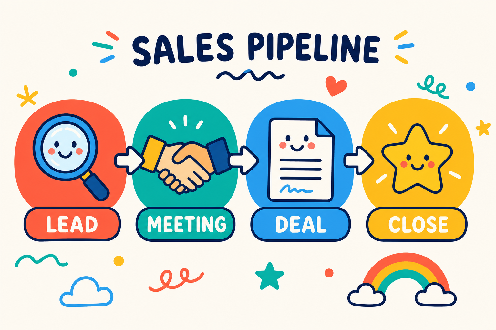

# מה זה CRM — ולמה כל עסק רציני צריך אחד

נתחיל מהסוף, כי זו השאלה האמיתית שהביאה אתכם לכאן.

**CRM היא מערכת לניהול קשרי לקוחות.** במילים הכי פשוטות — זה המקום שבו מנהלים את הלידים, הלקוחות, הפגישות, המכירות, המנויים והתשלומים של העסק. הכל במקום אחד.

ועכשיו האמת שלא כולם מספרים לכם: עסק שעובד בלי CRM לא יכול לגדול לאורך זמן. אפשר להסתדר בלי זה בהתחלה, אבל בשלב מסוים נתקלים בתקרת זכוכית — פשוט כי אין סדר, אין מעקב, ואין שליטה אמיתית בתהליכים.

---

## מה CRM עושה בפועל — בלי סיבוכים

מאחורי הקלעים, מערכת CRM בנויה כאוסף של טבלאות שמקושרות אחת לשנייה.

לדוגמה: יש טבלת לקוחות עם שמות, טלפונים ומיילים. לצידה יש טבלת מכירות עם כל העסקאות שבוצעו. **החיבור ביניהן הוא הקסם.**

כשנכנסים לכרטיס של לקוח מסוים — נגיד "איתי זרם" (כן, הוא קונה מלא, אז בטח הוא גם לקוח שלכם 😅) — רואים מיד במקום אחד:

- את כל המכירות שבוצעו מולו
- את המשימות הפתוחות לגביו
- את היסטוריית השיחות והפגישות

הכל מחובר. הכל מתועד. ואין יותר ניחושים ופספוסים.

---

## מה מערכת CRM עושה ביום-יום

במקום פתקים, יומן ידני וקבצי אקסל מפוזרים — CRM מרכזת את כל הפעולות ומאפשרת לעסק לעבוד בצורה מסודרת, עקבית ונשלטת.

הנה הדברים המרכזיים שמערכת CRM עושה עבורכם:

**ריכוז נתונים** — כל פרטי הלקוח בכרטיס אחד ברור: טלפון, מייל, תפקיד, תאריך לידה, וכל מה שחשוב לכם.

**תיעוד תקשורת** — המערכת שומרת היסטוריה מלאה של פגישות, מיילים ושיחות, כך שתמיד יודעים מה נאמר ומתי.

**ניהול משימות ופולואפים** — לא שוכחים לחזור ללקוח, לשלוח הצעת מחיר או לעשות פולואפ בזמן. זה אחד הכלים הכי חזקים להגדלת מכירות.

**אחסון מסמכים** — הצעות מחיר, חוזים וחשבוניות נשמרים ישירות בתוך כרטיס הלקוח, בצורה מסודרת.

**דאשבורדים ודוחות** — רואים תמונה ברורה של העסק: כמה כסף נכנס, מה אחוזי ההמרה, כמה עסקאות נסגרו החודש ומה צריך לשפר. הכל שקוף, מדיד וברור.

---

## למה CRM זה לא רק "כלי נוח" — יתרונות שמורגשים בחשבון הבנק

לשימוש ב-CRM יש יתרונות מאוד ברורים — לעסקים קטנים וגם לגדולים. והם לא נשארים על הנייר; הם מתורגמים די מהר לזמן שנחסך ולכסף שנכנס.

**אף ליד לא הולך לאיבוד** — כל פנייה נכנסת למערכת ומתועדת. לא מפספסים הזדמנויות, ולא משאירים כסף על הרצפה — תופעה שמפתיע כמה שהיא נפוצה בעסקים בלי CRM.

**חיסכון אדיר בזמן** — פחות חיפושים אחרי מספרי טלפון ישנים, פחות ניחושים מה נאמר בשיחה הקודמת. התוצאה: יותר זמן על מה שבאמת מייצר גדילה.

**שיפור משמעותי בשירות הלקוחות** — הנה דוגמה מהחיים. מגיל צעיר הייתי מזמין את אותה פיצה בשוהם. וכל פעם מחדש ביקשו ממני טלפון, כתובת ותוספות — למרות שזה תמיד אותו הדבר. זה פשוט היה מבאס.

כשלקוח מתקשר ואתם יודעים מיד מי הוא, מה הוא קנה ומתי דיברתם איתו לאחרונה — הוא מרגיש שמכירים אותו. התחושה הזאת מייצרת אמון, ואמון מייצר הכנסות.

**קבלת החלטות חכמה** — במקום לנחש, אתם רואים מספרים: איזה מוצר נמכר הכי טוב, איזה קמפיין עובד ואיפה שווה להשקיע. מפסיקים לעבוד על תחושות בטן ומתחילים לעבוד על דאטה.

**סטנדרטיזציה בצוות** — כולם עובדים באותה שיטה, שולחים את אותן הצעות מחיר, שומרים על תהליך אחיד. חלאס לברדק — העסק מתנהל כמו עסק רציני.

---

## למי CRM מתאים?

התשובה הקצרה: **לכל מי שיש לו לקוחות, והזמן שלו חשוב לו.**

התשובה המפורטת:

**עסקים קטנים ופרילנסרים** — זה שאתם עסק קטן לא אומר שאתם לא צריכים לחשוב על שלב הגדילה הבא. מי שלא עובד מסודר בהתחלה, מגלה שיותר קשה לעשות סקייל — גם כשיש ביקוש.

**צוותי מכירות** — חובה חובה חובה. אין מצב לנהל מכירות רציניות בלי CRM. כל עיכוב בחזרה לליד = סיכוי קטן יותר לסגור עסקה.

**מוקדי שירות לקוחות** — זוכרים את סיפור הפיצה? זה המינימום שמצפים ממנו בפיצרייה. מחברה עם טלפנים, הלקוחות מצפים להרבה יותר. שירות לקוחות בלי גישה מיידית להיסטוריית הפניות — פשוט לא עובד.

**חברות B2B** — אם יש מי שמעריך שירות, מקצועיות והיכרות אמיתית עם הלקוח, אלה עסקים. זה המקום האחרון שבו תרצו להיראות לא מסודרים.

---

## CRM מול מערכת אוטומציה שיווקית — מה ההבדל?

הרבה אנשים חושבים ש-CRM אומרת בהכרח גם אוטומציות. זה פשוט לא נכון.

CRM נועדה לנהל קשרים עם לקוחות. כן, לרוב מערכות ה-CRM יש אוטומציות פנימיות — יצירת משימות, תזכורות, שינוי סטטוסים — שעוזרות לעבוד מסודר יותר. אבל היכולות האוטומטיות של ה-CRM מוגבלות.

כשרוצים לבנות תהליכים חכמים באמת, כאלה שמחברים בין שיווק, מכירות ותפעול — צריך מערכת חיצונית. כאן נכנסות מערכות כמו Make, שמאפשרות לבנות אוטומציות מתקדמות בלי להיות תלויים במגבלות ה-CRM.

השילוב בין CRM מסודר לבין מערכת אוטומציה חכמה — הוא מה שהופך תהליך רגיל למערכת שמתנהלת כמעט לבד.

---

## איך בוחרים CRM שמתאים לעסק שלכם?

הדבר הכי חשוב להבין: בחירת CRM היא לא תחרות מלכת יופי. לא מחפשים את המערכת הכי צבעונית או עם הכי הרבה פיצ'רים — אלא את זו שנוח לעבוד איתה.

אל תסתנוורו מפיצ'רים מפוצצים שלא תשתמשו בהם. במקום זה, תתמקדו בדברים שבאמת עושים הבדל:

- **קלות שימוש** — אם זה מסובך, העובדים פשוט לא ישתמשו בזה
- **תמיכה בעברית**
- **חיבור למערכות שאתם כבר עובדים איתן**
- **תקופת ניסיון** — כמעט כל מערכת מאפשרת נסיעת מבחן. בדקו אותה בשטח, עם תהליכים אמיתיים

בסוף, המערכת המנצחת היא לא היקרה ביותר — אלא זו שהצוות שלכם אשכרה מצליח לתפעל ביום-יום, בלי לשבור את הראש.

---

## אוטומציות שאפשר לשלב עם CRM

זמן שווה כסף — וההחזר השקעה האמיתי נמצא בתהליכי האוטומציה שתיישמו. הנה כמה דוגמאות:

- **קליטת לידים** — ליד השאיר פרטים באתר? הוא נפתח אוטומטית במערכת ומקבל הודעת וואטסאפ: "קיבלנו את פנייתך".
- **תזכורות אוטומטיות** — סטטוס לקוח לא השתנה שבועיים? המערכת יוצרת לכם משימה: "צור קשר".
- **ברכות אישיות** — ללקוח יש יום הולדת? נשלח אליו SMS עם ברכה והטבה קטנה — אוטומטית.
- **הפקת מסמכים** — נסגרה עסקה? המערכת מפיקה חשבונית ושולחת אותה במייל — בלי התעסקות ידנית.

---

## שאלות ותשובות

**האם CRM מתאים גם לעסק בלי אנשי מכירות?**
כן. CRM לא מיועד רק למכירות — הוא מנהל לקוחות, תהליכים, שירות, מסמכים ותיאומים.

**כמה עולה מערכת CRM?**
מ-0 ₪ (יש מערכות חינמיות) ועד מאות שקלים בחודש. המחיר תלוי בכמות משתמשים, פיצ'רים וכמות הדאטה.

**האם אפשר לחבר CRM למערכות אחרות בעסק?**
בוודאי — וזה אחד היתרונות הכי גדולים. אפשר לחבר אתר, דפי נחיתה, מערכות חשבוניות, וואטסאפ, גוגל דרייב, ניהול תשלומים, צ'אטבוטים ועוד. כל CRM שנותן גישת API אפשר לחבר גם למערכות אוטומציה כמו Make.

**האם CRM בטוח לשימוש? מה לגבי מידע רגיש?**
רוב מערכות ה-CRM עומדות בתקני אבטחה גבוהים (GDPR, הצפנת מידע וכו'). חשוב לבחור מערכת מוכרת ולהגדיר הרשאות נכונות בצוות.

**האם CRM יכול להחליף עובדים?**
לא. CRM לא מחליף עובדים — הוא משחרר להם זמן לעבודות החשובות באמת. פחות בזבוז זמן על משימות לא יעילות = יותר מכירות, שירות טוב יותר ושקט נפשי.

**כמה זמן לוקח להטמיע מערכת CRM?**
תלוי בהיקף: עסק קטן — בין כמה שעות ליום עבודה אחד. עסק גדול עם צוותים ותהליכים מורכבים — בין מספר ימים לשבועות.

**האם צריך ידע טכני?**
לא צריך להיות מתכנתים. ידע בסיסי לגמרי מספיק. אם פעם בניתם מצגת בפאוורפוינט או שיחקתם עם אקסל — הרמה הטכנולוגית שלכם מספיקה לחלוטין. ברוב המקרים ההגדרה הראשונית היא החלק היחיד שדורש קצת עזרה מקצועית.

**האם CRM מתאים גם לעסק קטן של אדם אחד?**
בהחלט. דווקא כשהכל עליכם — CRM עוזר לשמור על סדר, לזכור פולואפים ולנהל לקוחות בצורה מקצועית, בלי אקסלים מפוזרים ופתקים. אני יכול להגיד בוודאות שזה עזר לי, ולתלמידים שלי, להגדיל משמעותית את כמות הלקוחות וההכנסות.

---

## לסיכום

אל תזניחו את נושא ה-CRM, ותבחרו מערכת שתתאים לכם — ולא כזו שתכריח אתכם להתאים את עצמכם אליה.

זה המעבר מעסק שמתנהל בכיבוי שריפות, לעסק שמנוהל על ידי סיסטם ברור, מדיד ורווחי.

אל תיבהלו מהטכנולוגיה — המערכות של היום בנויות כך שכל אחד יכול להפעיל אותן בקלות, בלי ללמוד ארבע שנים מדעי המחשב. תתחילו בקטן, תבנו את הטבלאות הראשונות, תעשו סדר בדאטה — ותראו איך העסק מתחיל להגדיל הכנסות בצורה שלא דמיינתם 🙂
